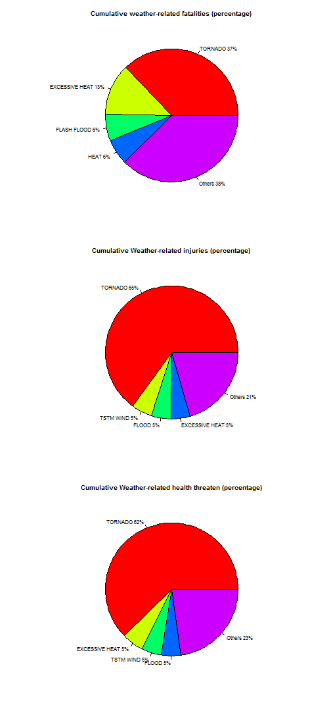
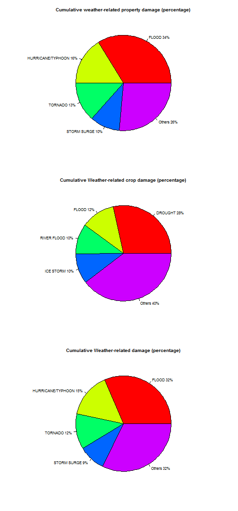

Exploratory analysis of the influence of Storms and other severe weather events on public health and economic problems

==========================================================================

## 1. Synopsis

Storms and other severe weather events can cause both public health and economic
problems for communities and municipalities. Many severe events can result in 
fatalities, injuries, and property damage, and preventing such outcomes to the 
extent possible is a key concern.

This project involves exploring the U.S. National Oceanic and Atmospheric 
Administration's (NOAA) storm database. This database tracks characteristics of
major storms and weather events in the United States, including when and where 
they occur, as well as estimates of any fatalities, injuries, and property damage.

Results revealed that the TORNADO and FLOOD are the most harmful with respect
to population health and economy, respectively.

## 2. Data Processing

### 2.1 Reading data


```r
datafile<-bzfile("repdata-data-StormData.csv.bz2")
data<-read.csv(datafile)
```

### 2.2 Cleaning and reshape data

```r
data <- data[,c(2,8,23:28)]

# substitute K to 10^3, M to 10^6, and B to 10^9
data[,2] <- as.character(data[,2])
data[,6] <- as.character(data[,6])
data[,8] <- as.character(data[,8])
data[!(data[,6] %in% c("K","k","M","m","B","b")),6] <- 0
data[!(data[,8] %in% c("K","k","M","m","B","b")),8] <- 0
data[data[,6] == "K" | data[,6] == "k",6] <- 1000
data[data[,6] == "M" | data[,6] == "m",6] <- 1000000
data[data[,6] == "B" | data[,6] == "b",6] <- 1000000000
data[data[,8] == "K" | data[,8] == "k",8] <- 1000
data[data[,8] == "M" | data[,8] == "m",8] <- 1000000
data[data[,8] == "B" | data[,8] == "b",8] <- 1000000000
data[,5] <- as.numeric(data[,5])
data[,6] <- as.numeric(data[,6])
data[,7] <- as.numeric(data[,7])
data[,8] <- as.numeric(data[,8])
data <- cbind(data[,1:8],PROP=data[,5] * data[,6], CROP=data[,7] * data[,8])

# get sum of FATALITIES and INJURIES for each type of events
health <- aggregate(data[,3:4],by=list(EVTYPE=data[,2]),sum,na.rm=T)
health <- cbind(health,TOTAL=health[,2]+health[,3])

# get sum of property and crop damage ($ dollar)
economic <- aggregate(data[,9:10],by=list(EVTYPE=data[,2]),sum,na.rm=T)
economic <- cbind(economic,TOTAL=economic[,2]+economic[,3])
```

## 3. Results

### 3.1 Across the United States, which types of events are most harmful 
### with respect to population health?

Pie chart summary:


```r
# sorting data
health4 <- health[order(health[,4],health[,3],health[,2],decreasing = T),]
health3 <- health[order(health[,3],health[,4],health[,2],decreasing = T),]
health2 <- health[order(health[,2],health[,4],health[,3],decreasing = T),]

# plotting
plotPie <- function (Health,n,m,main){
    simpleHealth <- Health[1:n,c(1,m)]
    simpleHealth <- rbind(simpleHealth,c("Others",sum(Health[-(1:n),m])))
    simpleHealth[,2] <- as.numeric(simpleHealth[,2])
    pct <- round(simpleHealth[,2] / sum(simpleHealth[,2]) * 100)
    lbl <- paste0(simpleHealth[,1]," ",pct,"%")
    pie(simpleHealth[,2],labels=lbl,col=rainbow(length(lbl)),main=main)
}
par(mfrow=c(3,1))
plotPie(health2,4,2,"Cumulative weather-related fatalities (percentage)")
plotPie(health3,4,3,"Cumulative Weather-related injuries (percentage)")
plotPie(health4,4,4,"Cumulative Weather-related health threaten (percentage)")
```

 

As shown in the pie charts, the TORNADO is the most harmful with
respect to population health, which has caused 9.6979 &times; 10<sup>4</sup> fatalities and
injuries. TORNADO is (also) the most harmful events that caused death
(9.6979 &times; 10<sup>4</sup> fatalities), and TORNADO is (also) the most harmful 
events that caused injury (9.6979 &times; 10<sup>4</sup> injuries).

### Across the United States, which types of events have the greatest economic consequences?

Pie chart summary:


```r
# sorting data
economic4 <- economic[order(economic[,4],economic[,3],economic[,2],decreasing = T),]
economic3 <- economic[order(economic[,3],economic[,4],economic[,2],decreasing = T),]
economic2 <- economic[order(economic[,2],economic[,4],economic[,3],decreasing = T),]

# plotting
par(mfrow=c(3,1))
plotPie(economic2,4,2,"Cumulative weather-related property damage (percentage)")
plotPie(economic3,4,3,"Cumulative Weather-related crop damage (percentage)")
plotPie(economic4,4,4,"Cumulative Weather-related damage (percentage)")
```

 

As shown in the above pie charts, the FLOOD has caused the greatest 
economic consequences, with a total of 1.5032 &times; 10<sup>11</sup> dollas. 
FLOOD is (also) the most harmful events that caused economic loss of
property ( as much as 1.5032 &times; 10<sup>11</sup> dollars), and DROUGHT is 
(also) the most harmful events that caused crop damage, which caused economic 
loss of 1.5019 &times; 10<sup>10</sup> dollars.
